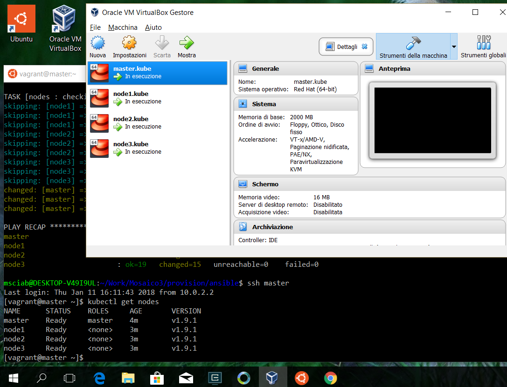

# Mosaico 3

Scripts to install a kubernetes cluster in Vagrant

You need a `bash` enviroment with SSH, either a Linux Distro, a Mac OSX or Windows 10 Bash (see below for Windows)

You need also VirtualBox, Vagrant and Ansible installed in your environment. 

# Setup on Linux/OSX

The kit is for Unix, so works out of the box in Linux and OSX, as follows.

## Create VMs with vagrant

- `cd provision/vagrant`
- `vagrant up`
- `vagrant ssh-config >>~/.ssh/config`

## Edit your `hosts` file

Run `sudo vi /etc/hosts` and add the following line:

`127.0.0.1 master node1 node2 node3`

## Provision with ansible

- `pip install ansible`
- `cd ../ansible`
- `ansible-playbook site.yml`

That is. Once done, `vagrant ssh master` and start playing with `Kubernetes`

# Setup on windows

The kit work also on Windows 10. However since Windows is not a native Unix, the procedure is slightly more complex and involves the use of two shells, the native PowerShell and Windows Bash.

The main problem is on Windows, `ansible` is not available as a Windows application. You need to install [Windows 10 Bash](https://www.windowscentral.com/how-install-bash-shell-command-line-windows-10) to use Ansible.  On the other side, both VirtualBox and Vagrant are native Windows applications and does not work with Windows Bash.

So the procedure on Windows 10 is the following.

## Create VMs with Vagrant in Windows

First of course download Mosaico. Then install [VirtualBox](https://www.virtualbox.org/wiki/Downloads) and [Vagrant](https://www.vagrantup.com/downloads.html) for Windows, and open a Windows shell (CMD or PowerShell).

- `cd provision\vagrant`
- `vagrant up`
- `vagrant ssh-config >config`

Note we started the VM with Vagrant for Windows and we saved the configuration in a local file.

## Add an entry in Windows hosts file

You need to launch notepad as an administrator. Search notepad then right-click and run it as an Administrator. Then open the file `c:\Windows\System32\Drivers\etc\hosts` and add the following line:

`127.0.0.1 master node1 node2 node3`

Remember to save it.

## Provision Kubernetes with Windows bash

Now, ensure you have Windows Bash. Go in the Windows Store and install Ubuntu.
Finally, open Windows bash and do the following steps.

First install `python`, `pip` and `ansible`:

- `sudo apt-get update`
- `sudo apt-get install python-pip`
- `sudo pip install ansible`

Second, create a proper configuration file for `ssh` (note we have to replace  `C:` with `/mnt/c`)

- `mkdir $HOME/.ssh`
- `cd Mosaico3/provision/vagrant`
- `sed -e 's!C:!/mnt/c!g' <config >>$HOME/.ssh/config`

Finally you can provision with `ansible` Kubernetes:

- `cd ../ansible`
- `ansible-playbook sites.yml`
